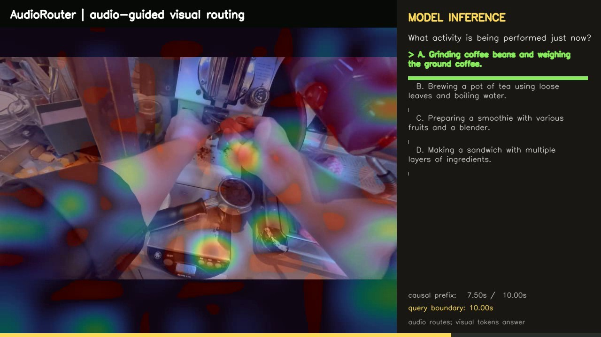
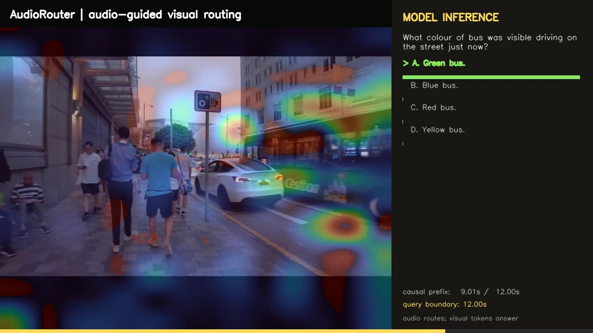
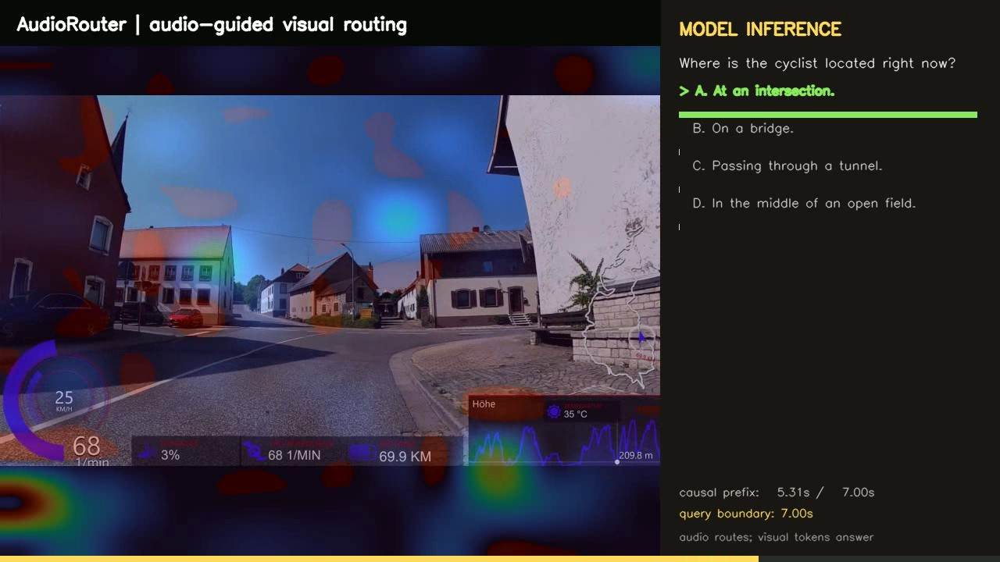
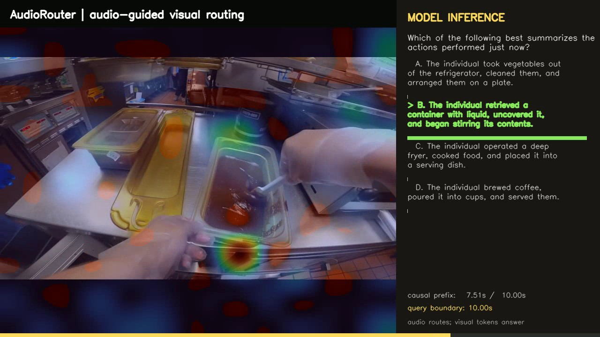
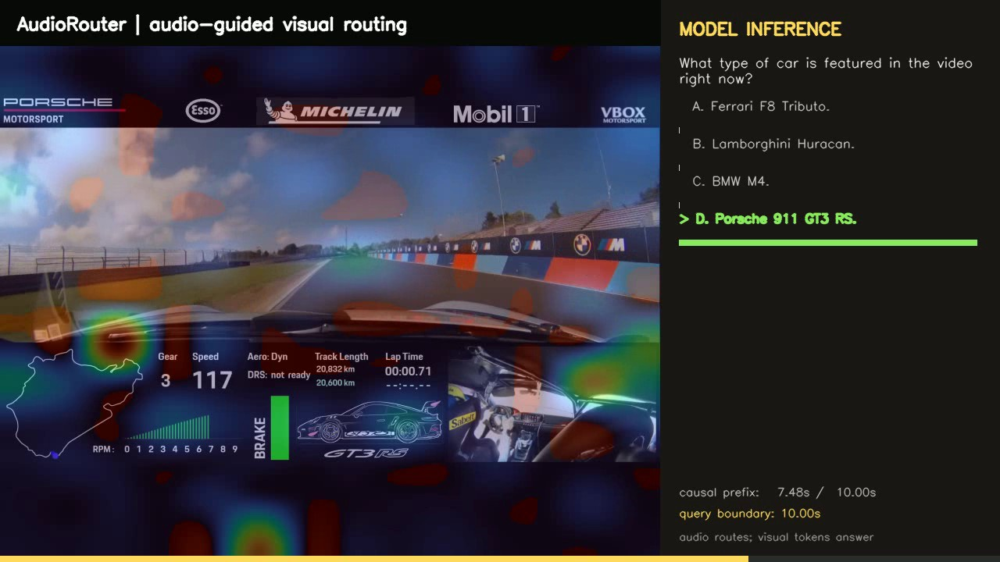
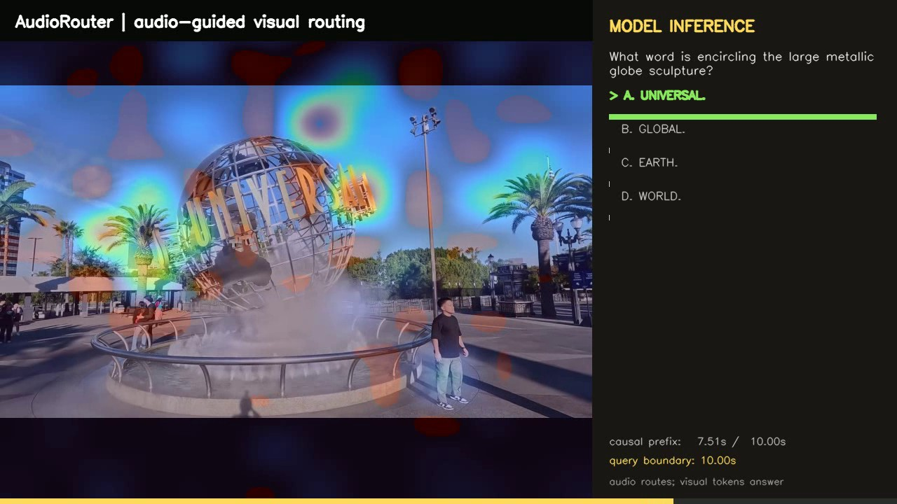
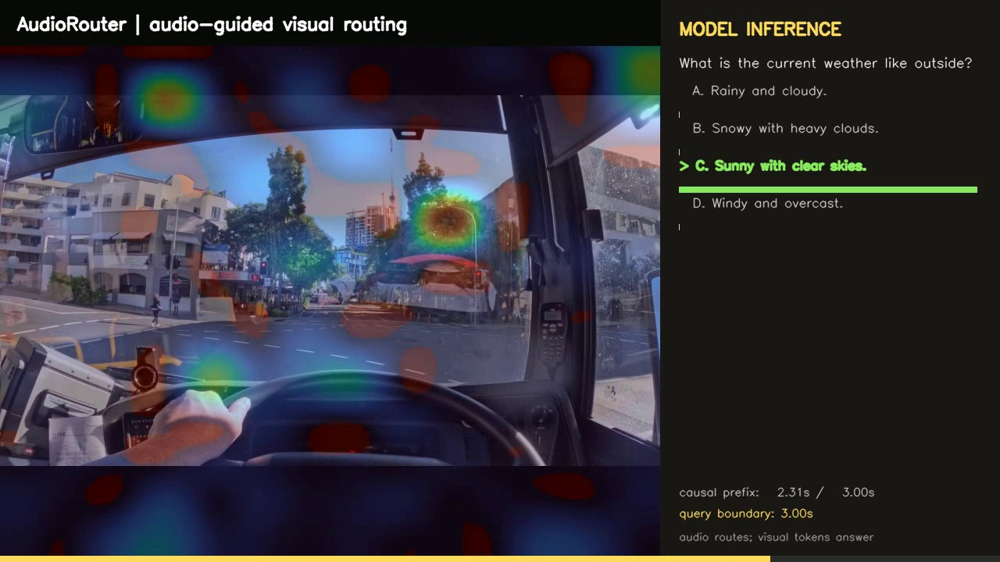
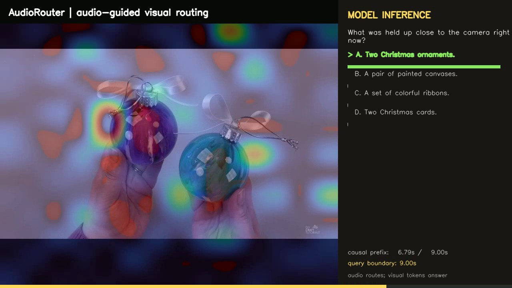
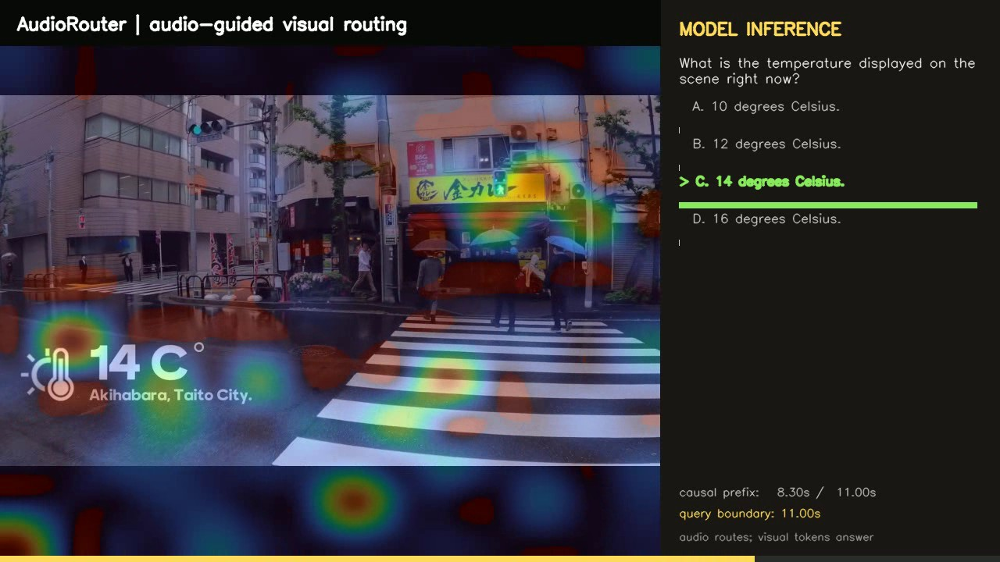

# AudioRouter: Audio-Guided Visual Compression for Streaming Video Language Models

AudioRouter uses synchronized audio as a perception-level routing signal: audio
decides **where to look**, while native visual tokens decide **what the language
model sees**. Audio is never inserted into the LLM token stream.

The routed visual representation is

\[
P=\operatorname{softmax}(Q_{audio}K_{visual}^{T}/\tau),\qquad Z=PV_{visual}.
\]

The released configuration compresses each frame from 196 visual tokens to 64
audio-conditioned visual tokens. LLaVA, SigLIP, the visual projector, and BEATs
remain frozen; only the AudioRouter bottleneck is trained.

## Verified results

The following numbers were reproduced from scratch on the held-out splits on
2026-09-17 using real audio, greedy decoding, `fps=auto`, and no frame cap.

| Benchmark | Checkpoint | Inference tau | Correct / total | Accuracy |
|---|---|---:|---:|---:|
| VideoMME Short | `ckpt/videomme_adbt_epoch3.pt` | 0.03 | 144 / 210 | 68.5714% |
| VideoMME Medium | `ckpt/videomme_adbt_epoch3.pt` | 0.03 | 84 / 147 | 57.1429% |
| VideoMME Long | `ckpt/videomme_adbt_epoch3.pt` | 0.03 | 97 / 183 | 53.0055% |
| **VideoMME Overall** | `ckpt/videomme_adbt_epoch3.pt` | 0.03 | **325 / 540** | **60.1852%** |
| MLVU Full MCQA | `ckpt/mlvu_full_adbt_epoch2.pt` | 0.015 | 291 / 429 | 67.8322% |
| StreamingBench Real-Time | `ckpt/streamingbench_realtime_adbt_epoch3.pt` | 0.05 | 362 / 500 | 72.4000% |

VideoMME Overall is weighted by the number of questions in each split; it is
not the simple mean of the three percentages. The VideoMME score covers the
project's held-out 180-video/540-question split, not all 2,700 official rows.

## Released checkpoints

| File | SHA256 |
|---|---|
| `ckpt/videomme_adbt_epoch3.pt` | `1230ce639c8621ffcbb9d3d906179a454a1015475f0ee1b7d3957dc50ce631ec` |
| `ckpt/mlvu_ego_adbt_epoch3.pt` | `53835943f7d21129520ac532c05c169f422a40b617bb39949dddbae6e4313a1d` |
| `ckpt/mlvu_full_adbt_epoch2.pt` | `043b2c7227d841197244816db3c8032f671e4d7e8671b20617f3a41c721cb999` |
| `ckpt/streamingbench_realtime_adbt_epoch3.pt` | `9d12f5c70c7b1bcdea984a324765dc31de223aca38154c7301328f440fbdb949` |

Use baidu pan to download：ckpt.zip
url: https://pan.baidu.com/s/1dzwfvaY7KRffPupobFBKvg?pwd=ga2x extract code: ga2x

## Installation

```bash
git clone --recursive https://github.com/saber23324/AudioRouter.git
cd AudioRouter
conda create -n audiorouter python=3.10 -y
conda activate audiorouter
pip install -r requirements.txt
pip install -e LLaVA-NeXT -e lmms-eval
```

## Download the frozen base models

### BEATs audio encoder

AudioRouter uses this exact checkpoint from the pretrained-model table in
[`unilm/beats/README.md`](unilm/beats/README.md):

- Version: **Fine-tuned BEATs_iter3+ (AS2M) (cpt1)**
- Official download: [BEATs_iter3+ AS2M cpt1](https://1drv.ms/u/s!AqeByhGUtINrgcpoZecQbiXeaUjN8A?e=DasbeC)
- Expected filename: `BEATs_iter3_plus_AS2M_finetuned_on_AS2M_cpt1.pt`
- File size: `363145291` bytes
- SHA256: `7f9362028ac6e5c049e8dc314d87e90e4f82a15a8e472deb56af55d7f9b34d6a`
- Runtime audio configuration: 16 kHz mono audio, causal 2-second windows,
  temporal 768-dimensional BEATs encoder features

Download the checkpoint from the official link, keep the filename above, and
place it anywhere outside Git. For example:

```bash
mkdir -p models/beats
mv /path/to/downloads/BEATs_iter3_plus_AS2M_finetuned_on_AS2M_cpt1.pt \
  models/beats/

export BEATS_CHECKPOINT="$PWD/models/beats/BEATs_iter3_plus_AS2M_finetuned_on_AS2M_cpt1.pt"
sha256sum "$BEATS_CHECKPOINT"
```

The printed hash must match the SHA256 above. Do not substitute the Iter1,
Iter2, Iter3, AS20K, cpt2, tokenizer, or non-fine-tuned checkpoint when
reproducing the reported results.

### LLaVA-OneVision backbone

The reported experiments use the Hugging Face model
[`lmms-lab/llava-onevision-qwen2-7b-ov`](https://huggingface.co/lmms-lab/llava-onevision-qwen2-7b-ov),
not another LLaVA-OneVision size or Qwen variant. The locally verified snapshot
is revision `0b07bf7565e244cf4f39982249eafe8cd799d6dd`.

Download that exact snapshot into the standard Hugging Face cache with the
current `hf` CLI. The SigLIP vision tower is downloaded separately because the
LLaVA configuration resolves it as `google/siglip-so400m-patch14-384`:

```bash
python -m pip install -U huggingface_hub
export HF_HOME=/path/to/huggingface/cache

hf download lmms-lab/llava-onevision-qwen2-7b-ov \
  --revision 0b07bf7565e244cf4f39982249eafe8cd799d6dd

hf download google/siglip-so400m-patch14-384 \
  --revision 9fdffc58afc957d1a03a25b10dba0329ab15c2a3
```

The evaluation commands continue to use
`pretrained=lmms-lab/llava-onevision-qwen2-7b-ov`; Transformers resolves that
repository ID from `$HF_HOME`. Enable `HF_HUB_OFFLINE=1` only after both model
downloads have completed.

For the local development machine, the fully populated environment is already
available as `audiorouter`.

Set the runtime paths before evaluation:

```bash
conda activate audiorouter
export PYTHONNOUSERSITE=1
export PYTHONPATH="$PWD/lmms-eval:$PWD/LLaVA-NeXT:$PWD"
export HF_HOME=/path/to/huggingface/cache
export HF_HUB_OFFLINE=1
export TRANSFORMERS_OFFLINE=1
export TOKENIZERS_PARALLELISM=false
export PYTORCH_CUDA_ALLOC_CONF=expandable_segments:True
export BEATS_CHECKPOINT=/path/to/BEATs_iter3_plus_AS2M_finetuned_on_AS2M_cpt1.pt
export BEATS_EMBEDDING_CACHE="$PWD/results/cache/beats"
```

## Data and held-out splits

The normalized manifests and deterministic split files are included under
`results/dataset_manifests/` and `results/dataset_splits/`. Media files are not
redistributed. Update the `video_path` values in a copied manifest when your
media root differs from the original layout.

| Benchmark | Manifest / dataset | Held-out split |
|---|---|---|
| VideoMME | local Hugging Face `lmms-lab/Video-MME` cache | `results/adbt_videomme_split.json` |
| MLVU Full MCQA | `results/dataset_manifests/mlvu_full_mcqa.json` | `results/dataset_splits/mlvu_full_mcqa_seed1234_pathgroup_80_20.json` |
| StreamingBench Real-Time | `results/dataset_manifests/streamingbench_realtime.json` | `results/dataset_splits/streamingbench_realtime_seed1234_80_20.json` |

## Quick reproduction

The fastest guided entry point is
[`notebooks/quick_reproduce.ipynb`](notebooks/quick_reproduce.ipynb). It checks
the environment and checkpoint hashes, offers a one-video smoke test, and
contains the exact full-validation commands.

### VideoMME

Run all three splits without `--limit`:

```bash
bash scripts/run_phase5_short_ablation.sh 0 real \
  ckpt/videomme_adbt_epoch3.pt results/verify-videomme-short \
  0.03 videomme_short

bash scripts/run_phase5_short_ablation.sh 1 real \
  ckpt/videomme_adbt_epoch3.pt results/verify-videomme-medium \
  0.03 videomme_medium

bash scripts/run_phase5_short_ablation.sh 2 real \
  ckpt/videomme_adbt_epoch3.pt results/verify-videomme-long \
  0.03 videomme_long
```

Expected scores are 68.5714, 57.1429, and 53.0055. Their question-count
weighted Overall is 60.1852.

### MLVU Full MCQA

```bash
CUDA_VISIBLE_DEVICES=0 python -m AudioRouter.eval_adbt_mcqa \
  --dataset-manifest results/dataset_manifests/mlvu_full_mcqa.json \
  --split-file results/dataset_splits/mlvu_full_mcqa_seed1234_pathgroup_80_20.json \
  --checkpoint ckpt/mlvu_full_adbt_epoch2.pt \
  --output results/verify-mlvu-full.json \
  --fps auto --max-frames 0 --audio-ablation real \
  --attention-temperature 0.015 \
  --vision-batch-size 8 --beats-batch-size 8 \
  --beats-checkpoint "$BEATS_CHECKPOINT"
```

Expected result: 291/429 (67.8322%), mean QA loss 0.882342, and 71,509
sampled frames.

### StreamingBench Real-Time

```bash
CUDA_VISIBLE_DEVICES=0 python -m AudioRouter.eval_adbt_mcqa \
  --dataset-manifest results/dataset_manifests/streamingbench_realtime.json \
  --split-file results/dataset_splits/streamingbench_realtime_seed1234_80_20.json \
  --checkpoint ckpt/streamingbench_realtime_adbt_epoch3.pt \
  --output results/verify-streamingbench-realtime.json \
  --fps auto --max-frames 0 --audio-ablation real \
  --attention-temperature 0.05 \
  --vision-batch-size 8 --beats-batch-size 8 \
  --beats-checkpoint "$BEATS_CHECKPOINT"
```

Expected result: 362/500 (72.40%) and 60,328 causal-prefix sampled frames.
Every question is evaluated only with frames/audio available at its own query
timestamp.

## Inference showcase video

### Pre-rendered causal inference demo

The following is a real AudioRouter inference on a held-out StreamingBench
Real-Time sample. Only the first 4 seconds of video and audio are available to
the model. AudioRouter predicts the labeled answer, **C. A building with
BASECAMP written on it**, with **99.24%** probability.

[](assets/02_sample_366.mp4)

Click the preview to play or download the full MP4 with its causal-prefix
audio. The colored overlay is the audio-conditioned visual routing map; the
right panel shows the question, option probabilities, prediction, and query
boundary.

- [Inference demo MP4](assets/02_sample_366.mp4)
- [Prediction, probabilities, timestamps, and routing diagnostics](assets/02_sample_366.json)

### Ten-example high-confidence gallery

| Preview | Sample and task | Rerun result |
|---|---|---|
| [](assets/demo_gallery/03_sample_333.mp4) | `sample_333`<br>Object Perception<br>12 s prefix | **A. Green bus.**<br>99.76% · [JSON](assets/demo_gallery/03_sample_333.json) |
| [](assets/demo_gallery/04_sample_164.mp4) | `sample_164`<br>Spatial Understanding<br>7 s prefix | **A. At an intersection.**<br>99.73% · [JSON](assets/demo_gallery/04_sample_164.json) |
| [](assets/demo_gallery/05_sample_376.mp4) | `sample_376`<br>Clips Summarize<br>10 s prefix | **B. Retrieved a liquid container, uncovered it, and stirred it.**<br>99.83% · [JSON](assets/demo_gallery/05_sample_376.json) |
| [](assets/demo_gallery/06_sample_262.mp4) | `sample_262`<br>Text-Rich Understanding<br>10 s prefix | **D. Porsche 911 GT3 RS.**<br>99.67% · [JSON](assets/demo_gallery/06_sample_262.json) |
| [](assets/demo_gallery/07_sample_308.mp4) | `sample_308`<br>Text-Rich Understanding<br>10 s prefix | **A. UNIVERSAL.**<br>99.74% · [JSON](assets/demo_gallery/07_sample_308.json) |
| [](assets/demo_gallery/08_sample_452.mp4) | `sample_452`<br>Attribute Perception<br>3 s prefix | **C. Sunny with clear skies.**<br>99.70% · [JSON](assets/demo_gallery/08_sample_452.json) |
| [](assets/demo_gallery/09_sample_69.mp4) | `sample_69`<br>Action Perception<br>9 s prefix | **A. Two Christmas ornaments.**<br>99.67% · [JSON](assets/demo_gallery/09_sample_69.json) |
| [](assets/demo_gallery/10_sample_323.mp4) | `sample_323`<br>Attribute Perception<br>11 s prefix | **C. 14 degrees Celsius.**<br>99.63% · [JSON](assets/demo_gallery/10_sample_323.json) |

The machine-readable gallery summary is available in
[`assets/demo_gallery/index.json`](assets/demo_gallery/index.json). The gallery
can be regenerated from the full validation output with:

```bash
CUDA_VISIBLE_DEVICES=0 python scripts/render_demo_gallery.py \
  --count 10 --max-query-time 12 \
  --exclude-video-id sample_313 \
  --output-dir assets/demo_gallery
```

### Render your own video

Create an MP4 that overlays the audio-conditioned routing map and displays the
multiple-choice prediction:

```bash
CUDA_VISIBLE_DEVICES=0 python scripts/render_inference_demo.py \
  --video /path/to/example.mp4 \
  --question "What happens after the person opens the door?" \
  --options "A. They sit down" "B. They leave" "C. They wave" "D. They cook" \
  --checkpoint ckpt/videomme_adbt_epoch3.pt \
  --attention-temperature 0.03 \
  --output results/demo/audiorouter_inference.mp4 \
  --include-audio
```

The script also writes a JSON sidecar containing the prediction, option
probabilities, sampling timestamps, checkpoint path, and causal query boundary.
`--include-audio` uses a system FFmpeg binary when available; without it, the
annotated MP4 is still produced as a silent video.

## Where-to-Look analysis

For the paper-style four-column mechanism visualization, use
`scripts/evaluate_where_to_look.py`. Full commands for VideoMME, MLVU, and
StreamingBench are documented in `AGENTS_AR.md`.

## Training

Training updates only the Audio Query Generator and
`AudioConditionedBottleneck`; the VLM and BEATs stay frozen. The exact staged
training commands, splits, and hyperparameters are in `AGENTS_AR.md`.

## Notes

- Audio controls visual compression weights but never enters the LLM directly.
- Formal evaluation uses `fps=auto`, `max_frames=0`, batch size 1 for
  VideoMME, and greedy decoding.
- StreamingBench strictly truncates every visual/audio prefix at that
  question's real-time timestamp.
- Evaluation outputs include per-question predictions, targets, losses, frame
  counts, and peak CUDA memory.

## Citation

Citation metadata will be added with the paper release.
